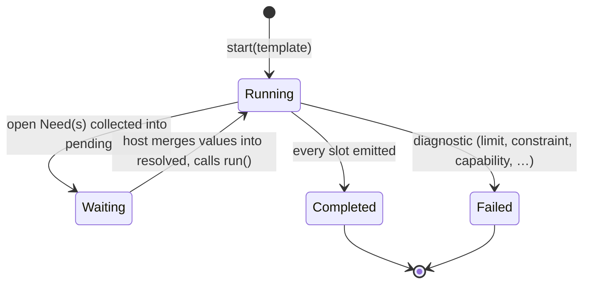
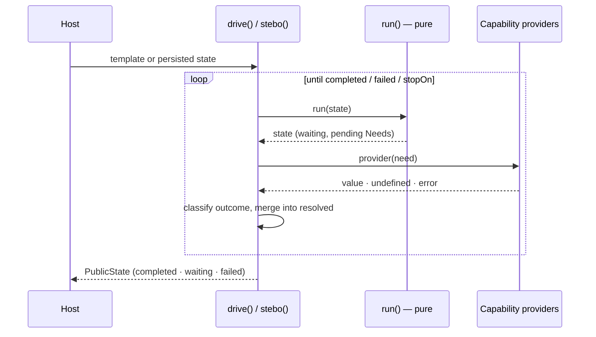

# Execution model

Seebo treats a template as a **conversation**: evaluation proceeds as far as the available
values allow, suspends on missing data, and resumes when the host provides it. This page
describes the state machine, the driver loop and the public contracts that cross the
engine↔application boundary. See the [architecture overview](overview.md) for the pipeline
and module map.

## The conversation

- `run(state) → state` evaluates as far as possible using only `state.resolved`, then
  collects the active `Need`s into `pending`. Pure, synchronous (IMPL §6.2).
- The **driver** satisfies `Need`s via capabilities and re-runs. Capabilities returning
  `undefined` mean "not me" (`Unresolved`); those listed in `stopOn` are returned to the
  caller (e.g. interactive `user`). See `ProviderOutcome` (IMPL §7.1).
- v1 resumes by **full re-evaluation** (strategy 1, IMPL §6.4); continuations/checkpoints
  are optional future optimizations and are intentionally absent.

## The driver loop

The async driver (`drive`/`stebo`) is the only component that touches the outside world,
and it does so exclusively through the capabilities the host registered:

Because `run` is pure and `PublicState` is JSON-serializable, the loop can stop at any
point, the state can be persisted or shipped across the network, and the conversation can
resume later — on the same machine or a different one, client or server.

## Public contracts and versioning (SPEC §2.1, IMPL §15)

Three independently-versioned contracts cross the engine↔application boundary:

- `astVersion` — the AST shape (`src/ast/nodes.js`).
- `stateVersion` — the `PublicState` shape (`src/run/run.js`).
- `analysisVersion` — the `Analysis` shape (`src/analyze/analyze.js`).

All start at `1` (clarifications §11). On `run`, a persisted `PublicState` is passed through
`migrateState` (`src/util/versions.js`): an older `stateVersion` is upgraded by applying the
registered migrators in sequence `v → v+1` (the `migrations` list is empty in v1), and a
**newer** `stateVersion` is rejected with `UNSUPPORTED_STATE_VERSION` rather than guessed
(IMPL §14, forward-compat not guaranteed).

## v1 scope notes (clarifications)

- All optimizations are **off by default**. `optimizations.astCache` is implemented as a
  transparent in-memory parse/analysis cache (IMPL §11/§12.1); `lazyParse`, `stream` and
  `objectPool` are accepted but inert. See [performance](../guide/performance.md).
- No streaming output (`steboStream`) is exposed in v1.
- No external runtime dependencies. A built-in `fake.*` library is **not** shipped; it is only
  an example of what `defineLibrary` enables.
- `date(pattern, text)` uses an internal mini parser/formatter over a normative token
  subset (`YYYY MM DD HH mm ss Z`).

## Positions (normative contract)

`Position` (`src/lexer/tokens.js`) is normatively **offset-based**: `{ start, end }`,
matching IMPL §2 and Appendix A.

!!! warning "Only offsets are normative"

    **Only `start`/`end` offsets are normative. `line`/`column` metadata is optional,
    derived from offsets, and provided solely for diagnostics/editor convenience.**

`start`/`end` are absolute offsets into the template source and are the only position
fields required by tokens, AST nodes, diagnostics, internal source maps and the
conformance tests. The optional `line`/`column` fields (v1 decision):

- MUST always be derivable from `start`/`end`;
- MUST NOT be required by normative tests;
- MUST NOT be used for semantic logic, parsing, validation or AST comparison;
- are NOT a stable compatibility surface and may be absent.

If an editor-friendly mode is needed later, prefer a separate utility such as
`enrichPositionsWithLineColumn(source, astOrTokens)` over depending on these fields.
