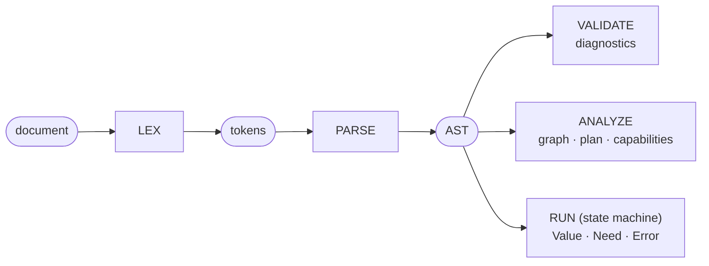
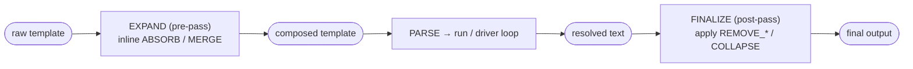

# Architecture overview

This page describes the Seebo pipeline and the responsibility of each module — how a
template goes from raw text to final output, and which part of the codebase owns each
step.

!!! success "Status: working engine core"

    The engine is implemented end-to-end: `tokenize`, `parse`, the runtime value system,
    the **suspendable evaluator** (`Ok | Susp | Err` with lazy gating and requirement
    `Need`s), the pure `run` state machine, the **async driver** (`drive`/`stebo`) with
    the four provider outcomes, `stopOn`, policy and limits, the static passes
    **`validate`** (accumulating diagnostics) and **`analyze`** (requirement graph,
    execution plan, metrics), and the macro passes **`expand`** (aggregators
    `ABSORB`/`MERGE`, pre-pass) and **`finalize`** (layout `REMOVE_*`/`COLLAPSE`,
    post-pass). The full expression grammar evaluates (literals, refs, producers,
    methods, object/array literals, operators incl. temporal arithmetic, ternary,
    desugared `match`). The full conformance suite runs with **no skipped tests**.
    Extension points are wired: custom types, functions/transformers, finalize macros
    and libraries; `builtins.{types,functions,macros}` expose the standard vocabulary
    for `...builtins.all`. Still pending: a shipped built-in `fake.*` library (the
    `defineLibrary` mechanism exists).

## Design principles

1. **Everything is typed** — values are `{ type, value, format, constraints }`;
   stringification happens only at slot emission.
2. **Pure evaluation** — no side effects; declarations are collected statically.
3. **Not Turing-complete** — bounded inclusion only; every evaluation terminates.
4. **Suspendable evaluation** — a node yields `Value | Need | Error`; a `Need` suspends
   instead of failing.

A guiding architectural rule: **the core is pure and synchronous; the only asynchronous
component is the driver.** This keeps the state serializable, the logic testable, and
lets the exact same code run on client and server.

## The pipeline

- **LEX / PARSE / VALIDATE / ANALYZE / RUN** are pure and synchronous.
- **EXPAND** (aggregators) and **FINALIZE** (layout) frame the execution.
- **The async DRIVER** sits around `run`, querying capabilities to satisfy `Need`s.

`VALIDATE` and `ANALYZE` are **independent static passes** over the same AST, not a chain:
the host calls `engine.validate(template)` to collect diagnostics and `engine.analyze(template)`
to obtain the `Analysis`. Neither is required by `run` (which re-parses and evaluates
directly); both are wired in `createEngine` and share the static symbol table.

### `validate`

Parses, builds the symbol table, and walks the AST reporting `UNDECLARED_NAME`,
`UNKNOWN_FUNCTION` (unknown producer / un-enabled library), `UNKNOWN_CAPABILITY`,
`POLICY_FORBIDDEN` (capability excluded by `policy.allowedCapabilities`),
`NON_EXHAUSTIVE_MATCH`, and the statically deducible type checks `UNKNOWN_METHOD`,
`ARITY_MISMATCH` and `TYPE_ERROR`. `NON_EXHAUSTIVE_MATCH` relies on a **non-normative
marker** the parser attaches to the outermost ternary of a `match` desugared without a `*`
arm (the marker is absent for exhaustive matches — including a `bool` match that covers
`true`+`false` — so their AST is unchanged).

The type checks are powered by a **conservative static type inferencer**
(`src/validate/infer.js`) that mirrors the runtime contract of `eval/methods.js` and
`eval/operators.js` at the type level. Its lattice is the eight base types plus `unknown`;
anything not provable (member access, custom types, library results, un-typed refs) collapses
to `unknown`, and any operation involving `unknown` is never reported — so `validate` only
flags violations it can prove and never produces false positives. The walk threads each
expression's inferred type bottom-up in a single pass; custom producers/transformers from the
registry are consulted so application extensions are not mis-reported. `validate` never
throws: a malformed template surfaces as a single `SYNTAX_ERROR` diagnostic.

### `analyze`

Consumes the AST + symbol table and computes the `Analysis`: `requirements` (enriched with
derived `phase` and `options`), the `requirementGraph` (edge `A → B` when `B` is declared
under a branch whose condition references `A`), the `executionPlan` (requirements grouped by
phase, where phase = longest dependency path), `capabilitiesUsed`, `staticValues`
(cold-resolvable pure formulas, evaluated with an empty environment), `deterministic`
(false when `now()`/`fake.*` appear — v1 is conservative), `streamability`, `potentialCycles`,
`maxPhases` (capped by `limits.maxPhases`) and `worstCaseRequirements`.

### Macro passes: `expand` and `finalize`

Macros live in two phases that **frame** execution, in the canonical order _compose →
resolve → clean up_. `stebo` chains them:

- **`expand({ template, templates }) → composed`** (async signature). Parses the source,
  replaces every aggregator slot by the (recursively expanded) referenced template, and
  copies everything else verbatim — so imported requirements later reach the symbol
  table. `ABSORB('name')` inlines one template; `MERGE('glob', sep?)` concatenates, in
  stable sorted order, the templates whose name matches an **anchored glob** (`*`/`?`
  only — linear-time, no ReDoS). Recursion is bounded by `limits.maxDepth`
  (`DEPTH_EXCEEDED`) and an inclusion chain (`INCLUSION_CYCLE`); both errors are turned by
  `stebo` into a `failed` state. A missing template inlines as empty.
- **Layout markers in the emitted text.** A layout macro is a **positional marker**. During
  evaluation, `run` emits a layout slot back as its canonical `@{NAME(args)}` source; a
  formula may _also_ produce that literal text (e.g. the string `'@{REMOVE_LINE}'`). Both
  forms are identical to the next pass.
- **`finalize(text) → text`** (sync, pure). Scans the resolved text for the recognized
  layout markers and applies them **left-to-right, recomputing offsets** after each edit:
  `REMOVE_LINE` drops the marker's line, `REMOVE_LEFT(n)`/`REMOVE_RIGHT(n)` drop the
  marker plus _n_ neighbouring chars, `COLLAPSE` removes itself and collapses runs of
  blank lines. Any unrecognized `@{…}` is left untouched, so arbitrary user data is never
  misinterpreted. No `eval`; deterministic.

!!! note "v1 scope"

    `validate`/`analyze` currently run on the **raw** template (they do not expand
    aggregators first), so requirements imported via `ABSORB`/`MERGE` are not yet seen by
    the static passes — a known limitation to lift once `expand` feeds the symbol table.

### Extensibility: the registry

`createEngine` builds one immutable
[`Registry`](https://github.com/BoniFederico/seebo/blob/master/src/runtime/registry.js)
from the config's `types`/`functions`/`macros`/`libraries`/`capabilities` and stores it on
the normalized config. It is the single read-only source of custom vocabulary, consulted by:

- the **parser** — library namespaces (enables `Namespace` nodes) and custom macro families;
- the **evaluator** — custom producers (`name(...)`), transformers (`recv.name(...)`, only
  when no builtin matches) and library functions (`ns.fn(...)`). Extension `eval` runs over
  **plain JS values** and its result is re-wrapped via `fromJs`, so extensions never touch
  internal `Value`s and cannot inject untyped data;
- the **driver** — the registered capability set, plus the trust policy (`policy.trustLevel`
  vs `capabilityRules[cap].allowFrom`) checked **before** a provider runs.

**Name governance** happens while building the registry: every introduced name is checked
against the reserved words (`RESERVED_NAME`) and for uniqueness in its namespace
(`NAME_CONFLICT`) — producers/types/libraries/capabilities share one namespace, macros another,
transformers are keyed per receiver type. A violation throws `EngineConfigError` at
`createEngine`. The `define*` factories return frozen descriptors; see the
[usage guide](../guide/usage.md) for examples.

## Module responsibilities

Each module is organized as **named contract file(s)** (the source of truth for shapes
and signatures) plus an `index.js` **barrel** that re-exports them.

| Module          | Contract file(s)                                     | Responsibility                                                                                                                   |
| --------------- | ---------------------------------------------------- | -------------------------------------------------------------------------------------------------------------------------------- |
| `src/lexer/`    | `tokens.js` + `lexer.js`                             | `Token`/`TokenType`/`Position`; `tokenize(input, options?)` (error-tolerant)                                                     |
| `src/ast/`      | `nodes.js`                                           | `Document` and node/`Expr` shapes (incl. `ObjectLit`/`ArrayLit`)                                                                 |
| `src/parser/`   | `parser.js`                                          | recursive descent + Pratt; `parse(tokens, options?)`; `PRECEDENCE`                                                               |
| `src/runtime/`  | `values.js`, `registry.js`                           | `Value` model + the extension `Registry` (custom vocab, name governance)                                                         |
| `src/eval/`     | `evaluator.js`                                       | suspendable evaluator `Ok \| Susp \| Err`; `RequirementDescriptor`                                                               |
| `src/run/`      | `run.js`                                             | pure state machine: `PublicState`, `RuntimeState`, `start`/`run`                                                                 |
| `src/validate/` | `validate.js`                                        | static diagnostics (undeclared names, arity, types, capabilities)                                                                |
| `src/analyze/`  | `analyze.js`                                         | `Analysis`: requirement graph, plan, metrics, `streamability`                                                                    |
| `src/macros/`   | `expand.js`, `finalize.js`                           | EXPAND aggregators (pre-pass) and FINALIZE layout (post-pass)                                                                    |
| `src/driver/`   | `async_driver.js`                                    | the only async layer; `ProviderOutcome`, `drive`, `stebo`                                                                        |
| `src/actions/`  | `contracts.js`, `plan.js`, `policy.js`, `execute.js` | action **contracts + pure planning + policy** (core-safe) and the **execution layer** (`seebo/actions`, the only effectful part) |
| `src/util/`     | `errors.js`, `versions.js`                           | `Diagnostic`/`DiagnosticCode`, error classes, contract versions                                                                  |
| `src/index.js`  | —                                                    | public API: `createEngine`, `builtins`, `define*`, config defaults                                                               |

### Actions: preparation vs. execution

The action subsystem is split so the purity rule holds physically, not just by convention:

- **Core-safe (imported by the pure core):** `contracts.js` (typedefs + status/error/event enums),
  `plan.js` (build an `ActionDescriptor`, normalize input, derive the idempotency key) and
  `policy.js` (pure allow/deny decisions, reused by `validate`). These perform no I/O.
- **Execution layer (`seebo/actions`):** `execute.js` is the **only** module that performs an
  effect — handler lookup, policy/permission/confirmation enforcement, dry-run, retry, audit, real
  execution, receipts and compensation. The pure core (`src/eval`, `src/run`, `src/analyze`,
  `src/validate`) **never imports it** — a conformance test asserts this. The dependency only flows
  inward (execute.js → contracts/policy/plan), never outward.

`action({...})` is evaluated by the suspendable evaluator like `need`: it is collected into the
`ActionPlan` only when its subtree is actually reached (lazy gating ⇒ "active actions only"), and
an unresolved input requirement marks it `blocked` while the `Need` still flows through the normal
suspend/resume loop. See the [actions guide](../guide/actions.md).

## Security & limits

The engine runs untrusted templates and untrusted data. Configurable resource limits
([`src/util/limits.js`](https://github.com/BoniFederico/seebo/blob/master/src/util/limits.js))
bound every phase and fail with a specific diagnostic code (`INPUT_LIMIT_EXCEEDED`,
`TOKEN_LIMIT_EXCEEDED`, `NODE_LIMIT_EXCEEDED`, `NESTING_LIMIT_EXCEEDED` at parse;
`STEP_LIMIT_EXCEEDED` at run; `DEPTH_EXCEEDED`, `MAX_PHASES_EXCEEDED`, `TIMEOUT` around the
driver). Prototype pollution is blocked at the data boundary (sanitizer + `safeSet`), and the
core uses no ambient globals or `eval`. The full threat model, limit table and out-of-scope
notes are in the [security model](../security/security.md).

## Where to go next

- [Execution model](execution-model.md) — the conversation loop, state machine and contracts.
- [Usage & extensibility](../guide/usage.md) — practical examples for every extension point.
- [Performance](../guide/performance.md) — benchmarks and the opt-in `astCache`.
