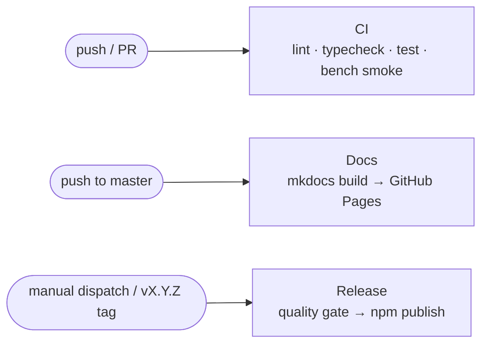

# Deployment & release

Seebo is a **library**: "deployment" means publishing to npm and keeping the quality gates
green. Three GitHub Actions workflows automate everything.



## Continuous integration

Defined in `.github/workflows/ci.yml`; runs on every push to `master` and on every pull
request, on a **Node 20 and 22 matrix**:

1. `npm ci`
2. `npm run lint` — ESLint
3. `npm run format:check` — Prettier
4. `npm run typecheck` — `tsc --noEmit` over the JSDoc contracts
5. `npm test` — the full unit + conformance suite
6. a guard that imports `seebo` and `seebo/actions`, so a broken `exports` map fails loudly
7. `npm run bench:smoke` — verifies the benchmark still runs

Superseded runs on the same ref are cancelled to save CI minutes.

## Releasing to npm

Defined in `.github/workflows/release.yml`. Two paths, both gated by `npm run check`
(format + lint + typecheck + test):

=== "One-click (recommended)"

    **Actions → Release → "Run workflow"**, pick the semver `bump`
    (patch/minor/major). The workflow bumps `package.json`, commits, tags `vX.Y.Z` and
    publishes — so the tag and the published version can never disagree.

=== "Tag push (fallback)"

    Pushing a `vX.Y.Z` tag also publishes, but a guard first checks that `package.json`
    already matches the tag, failing fast instead of hitting npm's "cannot publish over
    previously published versions" error.

Requirements and conventions:

- the repository secret `NPM_TOKEN` (an npm automation token) must be configured;
- releases follow [Semantic Versioning](https://semver.org/spec/v2.0.0.html) and are
  documented in the [changelog](../changelog.md) (Keep a Changelog format);
- `prepublishOnly` re-runs the quality gate locally, so a manual `npm publish` cannot skip it;
- the published package contains only `src/` (no tests, docs or bench).

## Documentation site

The documentation is built with **MkDocs Material** and published to **GitHub Pages** by
`.github/workflows/docs.yml` on every push to `master`:

1. checkout with full history (accurate "last updated" dates per page);
2. `pip install -r requirements.txt` (pinned MkDocs toolchain);
3. `mkdocs build --strict` — any broken internal link fails the build;
4. upload of the generated `site/` and deploy via the official
   `actions/deploy-pages` action.

!!! info "One-time repository setting"

    GitHub Pages must be set to deploy from GitHub Actions:
    **Settings → Pages → Build and deployment → Source: GitHub Actions**. This is a
    one-time, manual repository setting; without it the deploy job cannot publish.

To preview the site locally:

```bash
pip install -r requirements.txt
mkdocs serve          # live-reload preview at http://127.0.0.1:8000
mkdocs build --strict # the same check CI runs
```

## Runtime deployment notes (for hosts)

Embedding Seebo in an application has no infrastructure requirements — it is dependency-free
ESM that runs the same on server and client. Points worth knowing:

- the core is pure/synchronous, so **client and server can share the exact same code**; the
  backend remains the authority that re-runs and validates the authoritative output (see the
  [security model](../security/security.md#threat-model));
- `PublicState` is JSON-serializable — persist it in a session store to resume
  conversations across requests or processes;
- for long-lived server engines rendering repeated templates, enable
  `optimizations.astCache` (see [Performance](../guide/performance.md)).
