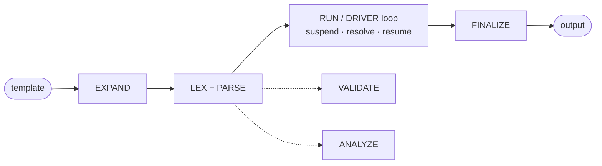

# Seebo

**Suspendable Evaluation Engine Built with Opus** — a suspendable evaluation engine in which
template rendering is one of the possible applications.

Seebo evaluates a small, strongly-typed expression language embedded in text. Evaluation is
**suspendable**: when a value is missing, the engine does not fail — it yields a typed
**requirement** (a `Need`) and pauses. A host (or the built-in async driver) provides the
value and resumes. The core is **pure and synchronous**; asynchrony is confined to the
driver, so the whole conversation state is serializable and the same code runs on client
and server.

```js
import { createEngine } from 'seebo';

const engine = createEngine({
  capabilities: { crm: (req) => ({ order: { id: 42, total: 1234.5 } })[req.id] },
  locale: 'it-IT',
});

const res = await engine.stebo({
  template:
    "Order ${ crm({ id:'order', type:object() }).id } — " +
    '${ float(order.total).constraints({ precision: 2 }) } €',
});
res.output; // 'Order 42 — 1234,50 €'
```

!!! tip "New to Seebo? Three pages get you productive"

    1. [Installation](getting-started/installation.md) — `npm install seebo`, Node ≥ 20.
    2. [First run](getting-started/first-run.md) — a 5-minute tutorial: render, suspend,
       resume.
    3. [Usage & extensibility](guide/usage.md) — declarations, extension points and
       realistic patterns.

## Why Seebo

- **Everything is typed** — `int`, `float`, `bool`, `string`, `datetime`, `duration`,
  `object`, `array`; stringification happens only at slot emission, driven by each value's
  `format` and `constraints`.
- **Suspendable by design** — missing data becomes a typed `Need` that pauses evaluation
  instead of throwing; the host resolves it and resumes, even across processes.
- **Pure, synchronous core** — no I/O, no ambient globals, no `eval`; the only async
  component is the driver. State is a serializable POJO.
- **Not Turing-complete** — bounded inclusion only; every evaluation terminates, with
  configurable [resource limits](security/security.md#configurable-limits) on every phase.
- **Extensible** — custom types, functions, libraries, capabilities, macros and action
  handlers via the `define*` factories, with strict name governance.
- **Effects as data** — `action(...)` declares external effects; the pure core only
  _prepares_ an action plan, execution is explicit via `seebo/actions`.
- **Zero runtime dependencies** — plain JavaScript + JSDoc, Node ≥ 20, no build step.

## The pipeline at a glance



Details in the [architecture overview](architecture/overview.md).

## Documentation map

| Section                                               | What you find there                                                |
| ----------------------------------------------------- | ------------------------------------------------------------------ |
| [Getting started](getting-started/installation.md)    | Install, configure an engine, run your first template.             |
| [Usage & extensibility](guide/usage.md)               | Declarations, `define*` extension points, realistic examples.      |
| [Actions](guide/actions.md)                           | Declaring external effects and executing action plans.             |
| [Architecture](architecture/overview.md)              | The pipeline, module responsibilities, the execution model.        |
| [API reference](api/overview.md)                      | The full public surface: engine methods, config, types, constants. |
| [Development](development/project-structure.md)       | Project structure, coding guidelines, debugging techniques.        |
| [Testing](testing/testing.md)                         | The unit + conformance suite and how it maps to the spec.          |
| [Security](security/security.md)                      | Threat model, limits, prototype-pollution protection, policy.      |
| [Deployment](deployment/deployment.md)                | CI, the npm release workflow and the docs pipeline.                |
| [Troubleshooting](troubleshooting/troubleshooting.md) | Symptom → diagnostic-code table, gotchas, known limitations.       |

## Status

The engine is **fully implemented** (v1): lexer → parser → `validate`/`analyze` → `run`,
framed by `expand` (aggregator macros) and `finalize` (layout macros), with the async
driver (`drive`/`stebo`) on top. The conformance suite runs with no skipped tests. See the
[changelog](changelog.md) for release notes.
